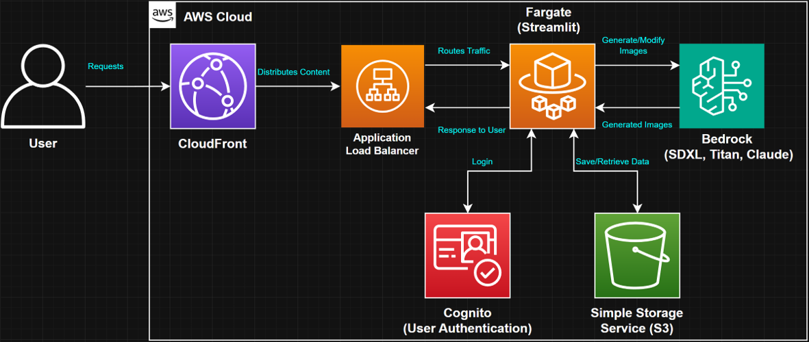

# Bedrock Image Generator and Editor with Prompt Checker and Chatbot

This document provides an overview of the architecture for our AI image generation application deployed on AWS.

## Architecture Overview

Our application leverages several AWS services to provide a scalable, secure, and efficient AI image generation platform. Here's a breakdown of each component:

### 1. User
The end-user who interacts with our application through a web interface.

### 2. CloudFront
Amazon CloudFront serves as our content delivery network (CDN), distributing the application globally for low-latency access.

### 3. Application Load Balancer (ALB)
The ALB routes incoming traffic to our application instances, ensuring high availability and efficient load distribution.

### 4. Fargate (Streamlit)
Our application runs on AWS Fargate, a serverless compute engine for containers. It hosts our Streamlit-based user interface and handles the core application logic.

### 5. Bedrock (SDXL, Titan, Claude)
Amazon Bedrock provides the AI models we use for image generation and manipulation:
- SDXL: Stability AI's advanced image generation model
- Titan: Amazon's proprietary image generation model
- Claude: Anthropic's large language model for text processing and assistance

### 6. Cognito (User Authentication)
Amazon Cognito manages user authentication, providing secure access to our application.

### 7. Simple Storage Service (S3)
Amazon S3 stores generated images, user data, and other persistent information required by our application.

## Data Flow

1. **User Requests**: Users interact with the application through their web browsers.

2. **Content Distribution**: CloudFront distributes the application content, improving load times and reducing latency.

3. **Traffic Routing**: The Application Load Balancer directs incoming requests to available Fargate instances.

4. **Application Processing**: Fargate hosts our Streamlit application, which processes user inputs and manages the overall user experience.

5. **AI Model Interaction**: The application communicates with Bedrock to generate and modify images based on user prompts.

6. **Authentication**: Cognito handles user logins and maintains session information.

7. **Data Persistence**: S3 is used to save and retrieve generated images and other necessary data.

8. **Response to User**: The generated or modified images are sent back through the ALB and CloudFront to the user's browser.

## Key Benefits

- **Scalability**: Fargate and ALB allow the application to scale based on demand.
- **Performance**: CloudFront ensures low-latency content delivery worldwide.
- **Security**: Cognito provides user authentication.
- **Flexibility**: The architecture supports multiple AI models through Bedrock.
- **Cost-Efficiency**: Serverless components like Fargate optimize resource usage and costs.

