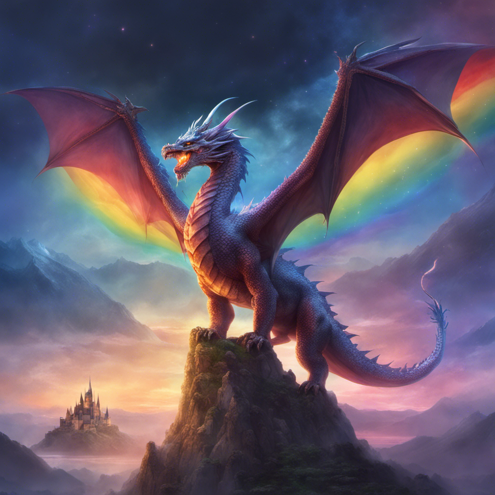
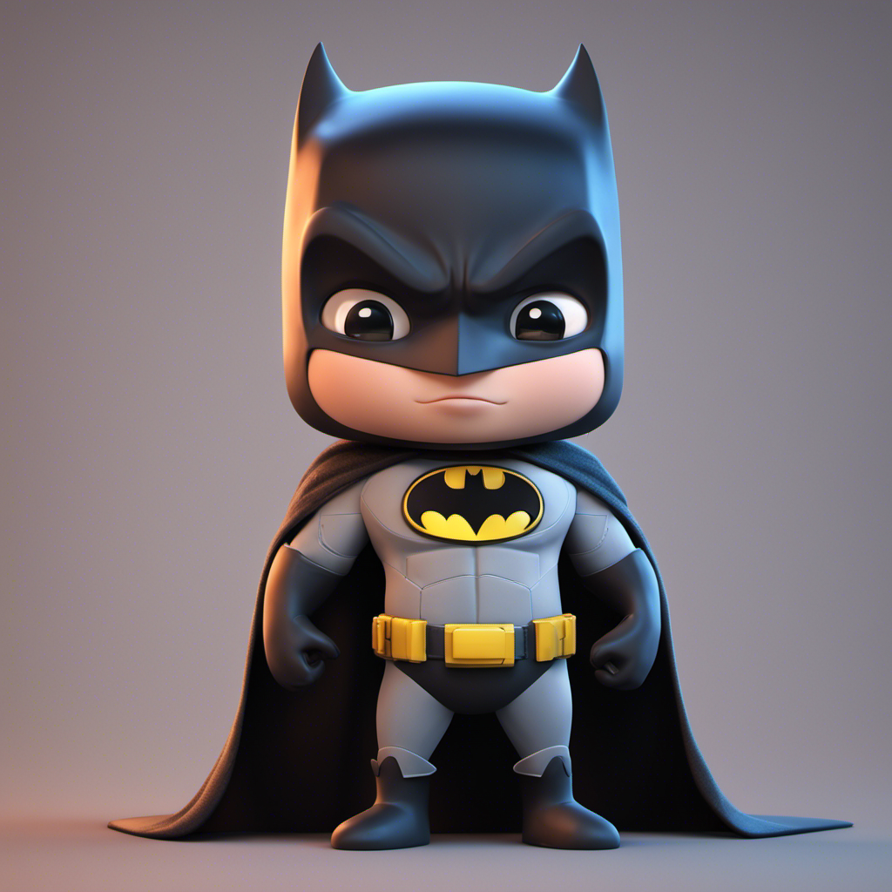
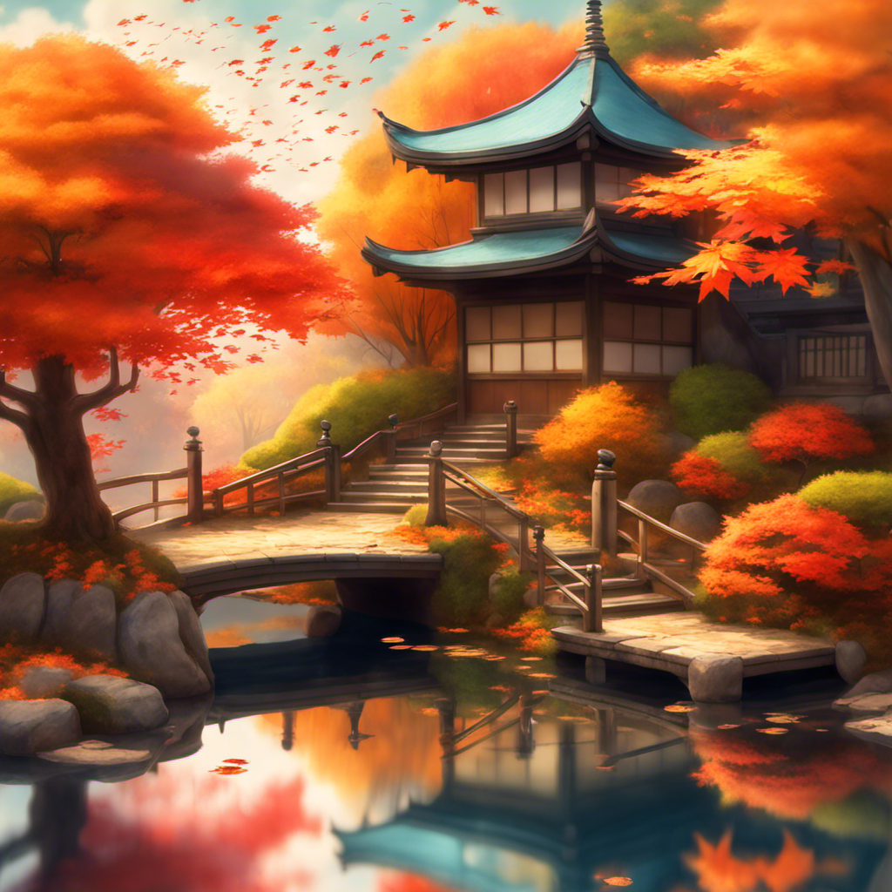
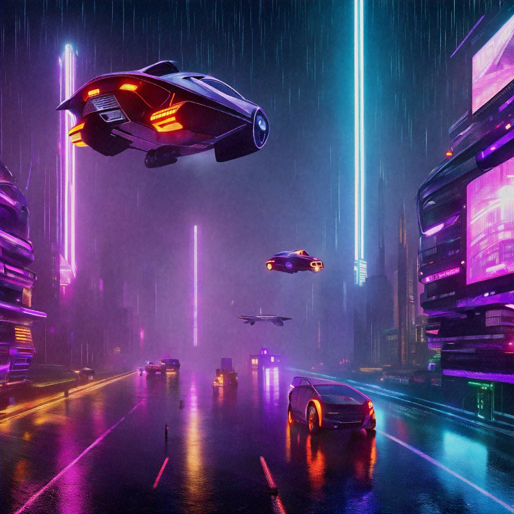
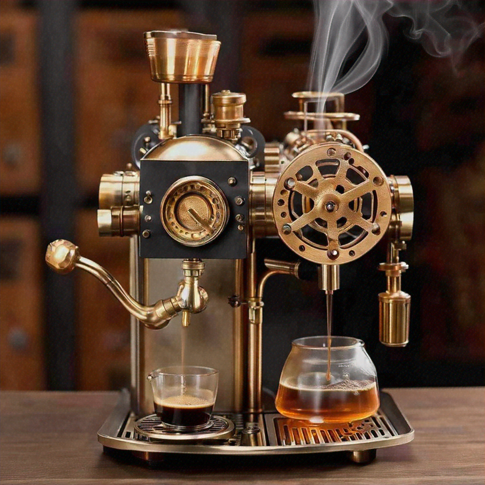
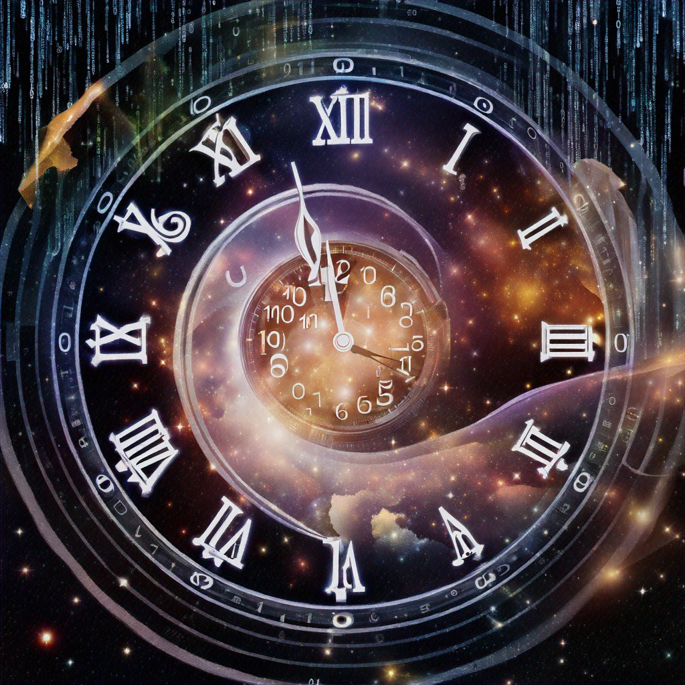

# Bedrock Image Generator and Editor with Prompt Checker and Chatbot
Welcome to our AWS Bedrock image generation application. This tool allows you to explore and compare two powerful AI image generation models: Stability.ai's SDXL 1.0 Image Generator and Amazon's Titan Image Generator G1. Both are available through AWS Bedrock, providing advanced image generation capabilities.
Here's how you can use this application:

1. Select your image generation model on the side bar (SDXL, Titan)
2. Create or select a session under the image generator model
3. Generate or upload your base/starting image
4. Create variations of your image
5. Edit the image by drawing on it
6. Switch between your base, variation, and editing steps
7. For a simplified experience, try Titan Image Chat Editor to use mask prompts
8. Manage your automatically saved sessions for each of your projects

You can iterate through these steps as many times as you like, refining your image until you achieve the desired result.

## Model Overview
🚀 Stability.ai SDXL 1.0 Image Generator

Stability.ai SDXL 1.0 is an open-source image generation model available through AWS Bedrock.

History and Development:

- Developed by Stability AI, a leader in open-source AI research
- Released in 2023 as an advancement over previous Stable Diffusion models
- Integrated into AWS Bedrock to provide enterprise-grade accessibility and scalability

Qualities:

- High-quality image generation in virtually any art style
- Exceptional photorealism capabilities
- Improved rendering of challenging elements like hands, text, and complex spatial arrangements
- Enhanced color accuracy, contrast, lighting, and shadows
- Versatile applications in art creation, creative tooling, and educational contexts

Features:

- Text-to-Image: Creates images from textual descriptions
- Image-to-Image: Modifies existing images based on text prompts and reference image
- Inpainting: Allows editing specific parts of an image
- Resolution: Supports multiple sizes and aspect rations
- Style Presets: Offers 17 built-in artistic styles
- Seed Control: Allows reproducibility with seeds from 0 to 4294967295
- CFG Scale: Adjustable from 0 to 35 for prompt adherence
- Steps: Configurable from 10 to 150 for generation refinement
- Samplers: Multiple options available for different image characteristics
- Image Strength: Adjustable from 0 to 1 for image variations
- Clip Guidance Preset: Controls how the model uses CLIP to guide the image generation

> Note: SDXL 1.0 represents a significant leap in image generation technology, offering users control and quality in their creative processes.

🦾 Amazon Titan Image Generator G1

Amazon Titan Image Generator G1 is a robust, enterprise-ready image generation model developed by Amazon Web Services (AWS).

History and Development:

- Created by Amazon as part of their Titan series of AI models
- Designed specifically for integration with AWS services and enterprise workflows
- Developed with a focus on versatility, safety, and scalability

Qualities:

- Built-in content filtering for safer outputs
- Optimized for high-volume, enterprise-level tasks
- Seamless integration with AWS ecosystem

Features:

- Text-to-Image: Creates images from textual descriptions
- Image-to-Image: Modifies existing images based on text prompts and reference image
- Inpainting: Allows editing specific parts of an image
- Outpainting: Replace background or extend bound of an image
- Prompt as a Mask: Use text to edit images
- Resolution: Supports multiple sizes
- Seed Control: Allows reproducibility with seeds from 0 to 2147483647
- CFG Scale: Adjustable from 1.1 to 10.0 for prompt adherence
- Multiple Images: Can generate up to 5 variations per request
- Similarity Strength: Adjustable from 0.2 to 1.0 for image variations
- Outpainting Modes: Offers 'Default' and 'Precise' options

> Note: Titan Image Generator G1 is engineered to meet the diverse needs of businesses and developers, offering a balance of powerful features and enterprise-grade reliability.

## 🖼️ Sample Outputs

Below are examples of images generated by each model, demonstrating their capabilities.

### Stability.ai SDXL 1.0 Image Generator Examples

| Fantasy Scene | Superhero | Stylized Nature Scene |
|:---:|:---:|:---:|
|  |  |  |
| **Prompt:** A majestic dragon perched atop a mountain. There is a rainbow starlit sky and castle in the background. | **Prompt:** batman, cute modern disney style, Pixar 3d portrait, ultra detailed, gorgeous, 3d zbrush, trending on dribbble, 8k render | **Prompt:** A serene Japanese garden in autumn, with a koi pond reflecting a pagoda and falling maple leaves, in the style of Studio Ghibli |

### Amazon Titan Image Generator G1 Examples

| Futuristic Urban Landscape | Detailed Object Rendering | Abstract Concept Visualization |
|:---:|:---:|:---:|
|  |  |  |
| **Prompt:** A futuristic cityscape with flying cars and holographic billboards, bathed in neon lights and light rain | **Prompt:** A steampunk-inspired coffee machine with brass gears and pipes, emitting aromatic steam | **Prompt:** An abstract representation of the concept of time, featuring melting clocks, spiraling galaxies, and streams of binary code |

> Note: The quality and characteristics of generated images can vary based on specific prompts, parameters, and random seed values used.

## 📊 Feature Comparison

| Feature | Description | Stability.ai | Amazon Titan |
|---------|-------------|--------------|--------------|
| Base Image (Text to Image) | Generate images from text descriptions. | ✅ Supported | ✅ Supported |
| Image Variation (Image to Image) | Create variations of an existing image. | ✅ Supported | ✅ Supported |
| Image Editing: Drawing a Mask on Canvas (Image to Image) | Edit parts of an image using a drawn mask. | ✅ Supported | ✅ Supported with Inpainting and Outpainting (Default and Precise) |
| Mask Prompt | Edit image using a prompt to create a mask | ❌ Not available | ✅ Supported |
| Image Upload | Ability to upload images for editing or variation. | ✅ Supported | ✅ Supported |
| Number of Images | Number of images that can be generated in a single request. | ✅ Fixed at 1 | ✅ 1-5 |
| Image Resolution | Pixel width and height. Higher pixel count = higher level of detail. | ✅ 1024x1024, 1152x896, 1216x832, 1344x768, 1536x640, 640x1536, 768x1344, 832x1216, 896x1152 | ✅ 1024x1024, 768x768, 512x512, 1152x896, 1216x832, 1344x768, 1536x640, 1280x768, 1152x640, 1173x640, 896x1152, 832x1216, 768x1344, 640x1536, 768x1280, 640x1152, 640x1173 |
| Text Prompt | Text input to guide image generation. | ✅ Up to 2000 chars | ✅ Up to 512 chars |
| Negative Prompt | Text input to specify unwanted elements in the image. | ✅ Up to 2000 chars | ✅ Up to 512 chars |
| Style Preset | Guides image model towards a particular style. This influences the overall look. | ✅ photographic, analog-film, anime, cinematic, comic-book, digital-art, enhance, fantasy-art, isometric, line-art, low-poly, modeling-compound, neon-punk, origami, 3d-model, pixel-art, tile-texture | ❌ Not available |
| Seed | Number for reproducible image generation. 0 is a random seed. | ✅ 0-4294967295 | ✅ 0-2147483647 |
| CFG Scale | Determines how much the final image portrays the prompt. Lower values = higher randomness. | ✅ 0-35 Scale | ✅ 1.1-10.0 Scale |
| Steps | Determines how many times the image is sampled. More steps can result in a more accurate result with longer processing time. | ✅ 10-150 Scale | ❌ Not available |
| Sampler | Method of generating data in a specific way. Different samplers can produce noticeable different results. | ✅ DDIM, DDPM, K_DPMPP_2M, K_DPMPP_2S_ANCESTRAL, K_DPM_2, K_DPM_2_ANCESTRAL, K_EULER, K_EULER_ANCESTRAL, K_HEUN, K_LMS | ❌ Not available |
| Image Strength/Similarity Strength | Controls how similar the variation is to the original. Higher values = more similar. | ✅ 0-1 Scale | ✅ 0.2-1.0 Scale |
| Clip Guidance Preset | A technique that uses the CLIP neural network to guide the generation of images to be more in-line with your included prompt, which often results in improved coherency. | ✅ FAST_BLUE, FAST_GREEN, NONE, SIMPLE SLOW, SLOWER, SLOWEST | ❌ Not available |
| Extras | Extra parameters passed to the engine. These parameters are used for in-development or experimental features and might change without warning. | ➖ Supported, not included in demo | ❌ Not available |

## 💰 Pricing Information

Current pricing for image generation and text processing through AWS Bedrock:

### Stability AI (SDXL 1.0) Pricing

| Resolution | Quality | Price per Image |
|------------|---------|-----------------|
| Up to 1024x1024 | Standard (<=50 steps) | $0.04 |
| Up to 1024x1024 | Premium (>50 steps) | $0.08 |

### Amazon Titan Pricing

| Resolution | Price per Image |
|------------|-----------------|
| 512x512, 768x768, 1152x640, 1173x640, 640x1152, 640x1173 | $0.0008 |
| 1024x1024, 1152x896, 1216x832, 1344x768, 1536x640, 640x1536, 768x1344, 832x1216, 896x1152, 1280x768, 768x1280 | $0.01 |

### Claude Pricing

Our application is configured with 400 Input Tokens and 800 Output Tokens. The temperature is set to 0.3. While the demo is running Claude 2.0, Claude 3 Sonnet is the recommended model for optimal performance.

| Model | Price per 400 Token Input | Price per 800 Token Output | Total per Input and Output Combined |
|-------|---------------------------|----------------------------|-------------------------------------|
| Claude 3 Sonnet | $0.0012 | $0.012 | $0.0132 |
| Claude 2.0 | $0.0032 | $0.0192 | $0.0224 |

> Note: It's recommended to use Titan to experiment with image generation prompts since it is significantly cheaper than Stability. For text processing and prompt engineering assistance, Claude 3 Sonnet offers better performance at a lower cost compared to Claude 2.0. Prices are subject to change. Always check the [official AWS Bedrock pricing page](https://aws.amazon.com/bedrock/pricing/) for the most up-to-date information.

## ➕ Additional Features

### 🤖 Claude Chatbot Assistant

Our Claude Chatbot Assistant is designed to enhance your image generation experience:
- Engage in interactive conversations to improve your prompts step-by-step by applying prompt engineering techniques
- Generate creative prompt ideas for specific companies or themes
- Get detailed information about Stability.ai SDXL 1.0 and Amazon Titan Image Generator G1
- Learn about pricing, features, and best practices for both models
- Receive guidance on advanced prompt engineering techniques

### ✍️ Prompt Engineering: Best Practices - Prompt Analysis Tool

Our Prompt Analysis is a powerful tool powered by Claude 2.0 to analyze and optimize your image generation prompts:
- Evaluates your prompt's strengths and areas for improvement
- Offers specific suggestions to enhance clarity, detail, and effectiveness
- Provides an improved version of your prompt as an example
- Suggests potential negative prompts to refine your results
- Explains the rationale behind suggested improvements

Use the Prompt Analysis Tool to refine your prompts and achieve better results with both Stability.ai SDXL 1.0 and Amazon Titan Image Generator G1.

> To access the Prompt Analysis Tool and Claude Chatbot Assistant, navigate to the Prompt Engineering: Best Practices and Claude Chatbot Assistant tabs respectively in the application sidebar.

## 📚 Additional Resources

For more information on using these models effectively:

- Consult the AWS Bedrock documentation for detailed API information and best practices
    - [General Bedrock Documentation](https://docs.aws.amazon.com/pdfs/bedrock/latest/userguide/bedrock-ug.pdf)

- Explore the model-specific documentation for Stability.ai SDXL 1.0 Image Generator and Amazon Titan Image Generator G1
    - [Stability.ai SDXL 1.0 Image Generator Documentation](https://docs.aws.amazon.com/bedrock/latest/userguide/model-parameters-stability-diffusion.html)
    - [Amazon Titan Image Generator G1 Documentation](https://docs.aws.amazon.com/bedrock/latest/userguide/model-parameters-titan-image.html)
    - [Anthropic Claude Models Documentation](https://docs.aws.amazon.com/bedrock/latest/userguide/model-parameters-claude.html)

- Experiment with different prompts and settings to understand each model's capabilities and limitations

## 📚 Final Thoughts and Limitations
After testing out both models, there are limitations. Stability tended to do a better job generating realistic and high quality images that Titan, however there weres some cases where both models generated fantastic results. Both still need work with generating text and human parts (e.g, fingers), however you are able to fine-tune Titan to address these limitations. 

I found that Titan did a better job editing an image with getting decent results the first try, while Stability took multiple tries by changing the mask, prompt, and different paramaters to get the result you want. Once you do get the results you want, I found the quality of Stability is generally better than Titan. You can always download a generated Stability image and edit under Titan with the image upload option in the first step. 

Moreover, Titan Image Generator G1 V2 has recently been released. This demo is running Amazon Titan Image Generator G1 V1. Consider changing the code for titan.py under pages_ui and models folders to leverage the new capabilities. Titan Image Generator v2 supports all the existing features of Titan Image Generator v1 and adds several new capabilities. It allows users to leverage reference images to guide image generation, where the output image aligns with the layout and composition of the reference image while still following the textual prompt. It also includes an automatic background removal feature, which can remove backgrounds from images containing multiple objects without any user input. The model provides precise control over the color palette of generated images, allowing users to preserve a brand's visual identity without the requirement for additional fine-tuning. Additionally, the subject consistency feature enables users to fine-tune the model with reference images to preserve the chosen subject (e.g., pet, shoe or handbag) in generated images. This comprehensive suite of features empowers users to unleash their creative potential and bring their imaginative visions to life. For more documentation, take a look at https://docs.aws.amazon.com/bedrock/latest/userguide/titan-image-models.html.

For Stability, there is news that SDXL 3.0 is coming out to Bedrock soon, so consider updating the code once that is released. 

According to Titan documentation, to remove objects during the inpainting editing step, you leave the text prompt empty. However, in this demo, you cannot generate an image unless a text prompt is inputed. To fix this, you will need to go back into the code such as changing the model invocation and generate button conditions from
    
    if st.button("Apply Editing", disabled=not prompt, help="Missing text prompt" if not prompt else ""):

to 

    # Determine if the button should be enabled
    button_enabled = bool(prompt.strip()) or (not prompt.strip() and editing_mode == "Inpainting")
    
    if st.button("Apply Editing", disabled=not button_enabled):

